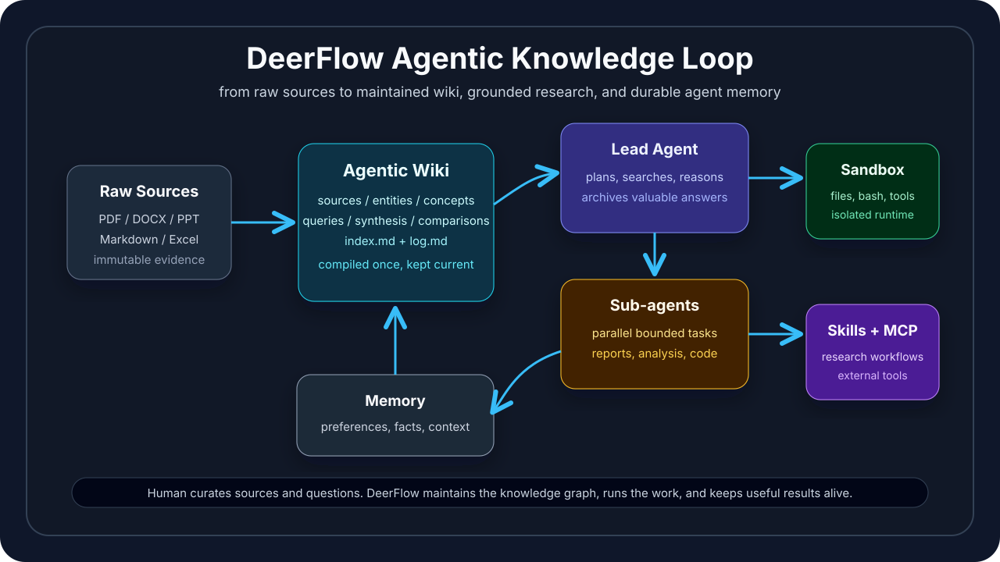
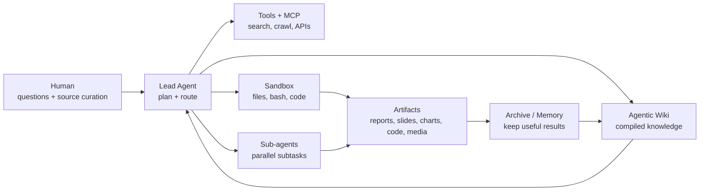
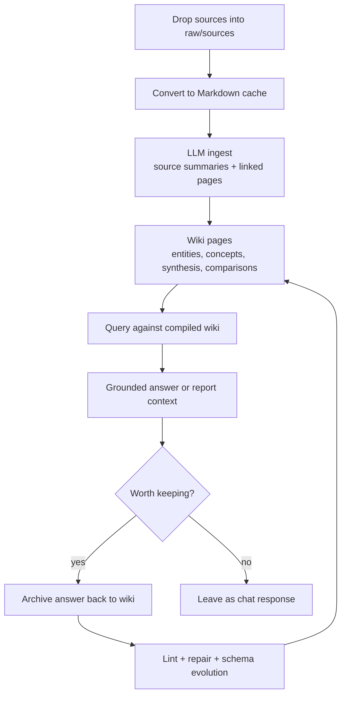

# DeerFlow 2.0

English | [中文](./README_zh.md)

[](./backend/pyproject.toml)
[](./Makefile)
[](./LICENSE)

DeerFlow is an open-source super-agent harness for long-running research and production-style agent work. It combines a LangGraph lead agent, delegated sub-agents, sandboxed execution, extensible skills, persistent memory, tool integrations, and an Agentic Wiki system that lets knowledge accumulate instead of being rediscovered on every query.

Version 2.0 is a ground-up rewrite. The original deep research framework remains on the [`1.x` branch](https://github.com/bytedance/deer-flow/tree/main-1.x).

Official site: [deerflow.tech](https://deerflow.tech)



## What Is This?

DeerFlow turns a chat-based agent into a maintained work system. It can read sources, operate on files, call tools, delegate work, generate artifacts, and keep the results in durable memory and wiki structures.

The LLM Wiki idea is central: instead of retrieving raw chunks on every question, DeerFlow lets the agent compile knowledge into a persistent wiki, then keep that wiki current as new files, answers, contradictions, and research directions appear.

## System Loop

Most agent stacks stop at chat plus tools. DeerFlow is built around a stronger loop:

1. Understand the task with the lead agent.
2. Use tools, uploaded files, web search, MCP servers, and skills to gather evidence.
3. Delegate bounded subtasks to sub-agents when parallel work helps.
4. Execute code and file operations in an isolated sandbox.
5. Preserve durable context through memory and the Agentic Wiki.
6. Produce artifacts such as reports, slides, charts, generated media, code, or maintained wiki pages.

The result is closer to an agent operating system than a single prompt chain.



## LLM Wiki Inspiration

DeerFlow's wiki layer follows the same broad pattern described by [nashsu/llm_wiki](https://github.com/nashsu/llm_wiki): raw sources stay immutable, the LLM maintains a structured Markdown wiki, and schema files define how the knowledge base should evolve.

What DeerFlow keeps from that pattern:

- **Raw Sources -> Wiki -> Schema** as the core knowledge architecture.
- **Ingest, Query, Lint** as the basic maintenance loop.
- `index.md` as the content catalog and `log.md` as the chronological operation trail.
- `[[wikilink]]` style cross-references and Markdown-first storage.
- The role split: humans curate and ask; the LLM maintains structure.

What DeerFlow adds around it:

- A LangGraph lead agent that can use the wiki during broader tool-using tasks.
- Sub-agent delegation for report sections, analysis branches, and implementation work.
- Sandboxed file and command execution for producing real artifacts.
- Skills for research, slides, charts, image/video generation, code documentation, and domain workflows.
- MCP integration, IM channels, persistent memory, and Gateway APIs.
- Wiki-specific tools for create, ingest, search, sync, lint, repair, schema evolution, answer archival, and report context packaging.

## Core Features

- **Lead agent orchestration**: one LangGraph entry point coordinates model selection, middleware, tools, uploads, memory, summaries, sub-agents, and clarification flow.
- **Sub-agents**: built-in `general-purpose` and `bash` sub-agents, plus custom agents from configuration. Sub-agents inherit bounded context and can work in parallel.
- **Agentic Wiki**: a local Markdown knowledge base maintained by the agent. It imports raw sources, generates linked pages, searches the compiled wiki, checks quality, repairs issues, and can archive valuable answers back into durable pages.
- **Skills**: structured workflow modules under `skills/public` and custom skill directories. Built-in skills cover deep research, data analysis, academic review, charts, slides, newsletters, code documentation, media generation, and more.
- **Tools and MCP**: built-in file, bash, image, task, wiki, search, crawl, and artifact tools, plus external tools through Model Context Protocol servers.
- **Sandbox and filesystem**: thread-local workspace, uploads, outputs, and skills paths. Supports local execution, Docker sandboxing, and Kubernetes-backed provisioning.
- **Persistent memory**: extracts stable user context, facts, preferences, and recent history, then injects useful memory into future runs.
- **Multi-channel access**: web UI, embedded Python client, and IM channels such as Slack, Telegram, Feishu/Lark, WeCom, and DingTalk.
- **Observability**: optional LangSmith and Langfuse tracing.

## Agentic Wiki

The wiki is the main knowledge feature in this project. It is not ordinary RAG over raw chunks. DeerFlow keeps a persistent, compounding Markdown wiki between the user and the source files.

### Design

- `raw/sources/`: immutable source documents.
- `raw/assets/`: extracted images and related source assets.
- `wiki/`: generated Markdown pages for sources, entities, concepts, queries, synthesis, comparisons, deep research, maintenance, index, and log.
- `.llm-wiki/`: internal metadata, source index, queue, and review state.
- `purpose.md` and `schema.md`: the operating contract that tells the agent how this wiki should be maintained.

### Workflow

- **Create**: `wiki_create` scaffolds a research wiki with the standard layout.
- **Ingest**: `wiki_add_source` imports Markdown, PDF, Word, PowerPoint, and Excel files, converts them to Markdown, summarizes sources, and generates linked wiki pages.
- **Search**: `wiki_search` searches generated wiki pages, using QMD when available and keyword fallback when not.
- **Sync**: `wiki_source_status` and `wiki_sync_sources` detect pending, stale, duplicate, and missing raw sources.
- **Maintain**: `wiki_lint` checks broken links, orphan pages, missing outlinks, stale claims, contradictions, and missing pages. `wiki_repair_lint` can propose or apply safe Markdown repairs.
- **Evolve**: `wiki_evolve_schema` updates the wiki schema contract when the knowledge base needs new page types or maintenance rules.
- **Archive**: `wiki_archive_answer` decides whether an answer is worth writing back as a query, synthesis, comparison, or page update.
- **Research context**: `wiki_research_context` uses QMD query retrieval, wiki graph expansion, and bounded page excerpts for complex questions, deep research reports, and sub-agent work.

This turns research into a cumulative artifact: each useful source and answer can strengthen the wiki rather than disappear into chat history.



## Visual and Generation Layer

DeerFlow is not limited to text reports. Through skills and sandbox tools it can turn wiki-grounded work into visual outputs:

- diagrams and architecture maps from Markdown or Mermaid
- charts and analytical graphics from data files
- slide decks from research outlines
- GPT-style image generation prompts and generated media assets
- video, podcast, newsletter, and web-page generation workflows

README banner prompt used for the framework image concept:

```text
Create a clean technical hero illustration for an open-source AI agent framework named DeerFlow.
Show a central "Agentic Wiki" knowledge graph connected to raw documents, a lead agent,
sub-agents, sandbox execution, tools/MCP, memory, and generated artifacts.
Style: polished dark-mode product architecture visual, crisp labels, subtle cyan/green/purple accents,
not cartoonish, no mascot, no watermark, suitable for a GitHub README.
```

## Architecture

```text
Browser / IM / Python client
        |
        v
Nginx on :2026
        |
        +--> Next.js frontend
        +--> LangGraph server on :2024
        |       `-- lead_agent
        |           +-- middleware
        |           +-- tools
        |           +-- sub-agents
        |           `-- sandbox
        |
        `--> Gateway API on :8001
                +-- models and config
                +-- MCP and skills
                +-- uploads and artifacts
                +-- memory
                +-- wiki
                `-- IM channels
```

## Quick Start

### Requirements

- Python 3.12+
- Node.js 22+
- `uv`
- `pnpm`
- Docker is recommended for sandboxed execution and deployment

### Configure

```bash
git clone https://github.com/bytedance/deer-flow.git
cd deer-flow
make setup
```

`make setup` launches an interactive wizard for model provider, API keys, web search, sandbox mode, bash access, and file-write behavior. It writes a minimal `config.yaml` and `.env`.

Run a setup check at any time:

```bash
make doctor
```

For manual configuration:

```bash
make config
```

Then edit `config.yaml` and `.env`.

### Run with Docker

```bash
make docker-init
make docker-start
```

Open [http://localhost:2026](http://localhost:2026).

### Run Locally

```bash
make check
make install
make dev
```

Open [http://localhost:2026](http://localhost:2026).

On Windows, use Git Bash for local development commands that invoke shell scripts.

## Common Commands

```bash
make setup           # interactive setup wizard
make doctor          # diagnose config and runtime requirements
make config          # create local config files
make config-upgrade  # merge new template fields into config.yaml
make check           # verify local dependencies
make install         # install backend and frontend dependencies
make dev             # start all services in development mode
make start           # start all services in production mode
make stop            # stop local services
make docker-start    # start Docker development services
make docker-stop     # stop Docker development services
make up              # build and start production Docker services
make down            # stop production Docker services
```

## Project Layout

```text
backend/   LangGraph agent runtime, Gateway API, tools, sandbox, memory, wiki, channels, tests
frontend/  Next.js web UI, docs UI, workspace components, browser tests
skills/    Built-in public skills and optional custom skills
docker/    Provisioner and deployment support
docs/      Architecture, configuration, wiki implementation notes, and setup docs
scripts/   Setup, diagnostics, serving, Docker, and configuration helpers
```

## Configuration Highlights

- `config.yaml`: models, tools, tool groups, sandbox, memory, skills, sub-agents, tracing, and channels.
- `extensions_config.json`: MCP server definitions and skill enablement.
- `.env`: API keys and local secrets.
- `DEER_FLOW_CONFIG_PATH`: override config file location.
- `DEER_FLOW_HOME`: override runtime state directory.
- `DEER_FLOW_SKILLS_PATH`: override skill search path.

Supported model configurations include OpenAI-compatible chat models, OpenAI Responses API mode, OpenRouter-style gateways, vLLM, Codex CLI, Claude Code OAuth, and custom provider classes.

## Documentation

- [Install guide](./Install.md)
- [Backend README](./backend/README.md)
- [Frontend README](./frontend/README.md)
- [Configuration guide](./backend/docs/CONFIGURATION.md)
- [MCP guide](./backend/docs/MCP_SERVER.md)
- [LLM Wiki Phase 2 summary](./docs/LLM_WIKI_PHASE_2_SUMMARY.md)
- [Contributing](./CONTRIBUTING.md)
- [Security policy](./SECURITY.md)

## Security

DeerFlow can run code, read and write files, call external tools, and connect to messaging platforms. Treat deployment as a privileged agent service.

- Prefer Docker or remote sandbox mode for untrusted workloads.
- Do not expose local development services directly to the public internet.
- Keep API keys in `.env` or a secret manager, not in `config.yaml`.
- Disable bash, file-write tools, or risky MCP servers when they are not required.
- Review IM channel configuration carefully before enabling bots in shared workspaces.

## License

DeerFlow is released under the [MIT License](./LICENSE).
