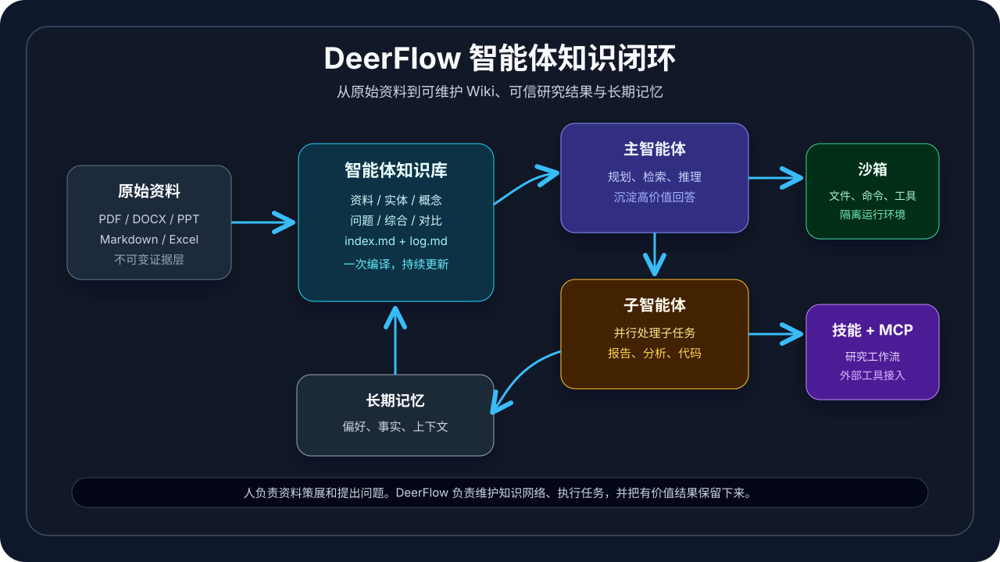
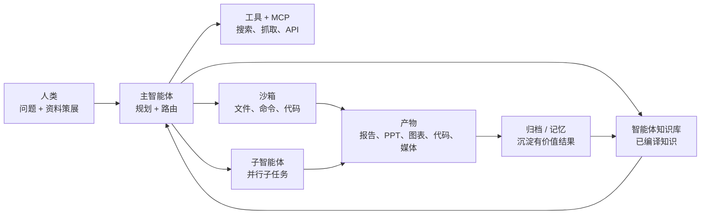
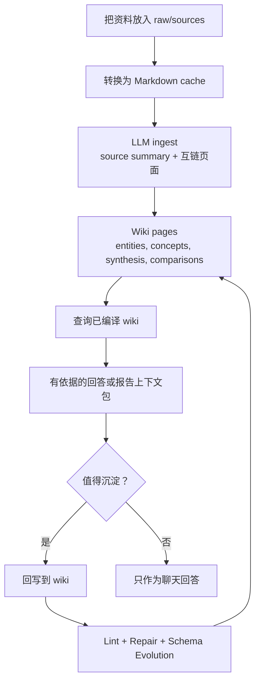

# DeerFlow 2.0

[English](./README.md) | 中文

[](./backend/pyproject.toml)
[](./Makefile)
[](./LICENSE)

DeerFlow 是一个开源的超级智能体运行框架，用来承载长时间研究、复杂任务分解和偏生产场景的 Agent 工作流。它把 LangGraph 主 Agent、子 Agent、沙箱执行、可扩展 Skills、持久记忆、工具集成和 Agentic Wiki 组织到一个完整系统里，让知识可以持续积累，而不是每次提问都从原始资料里重新检索和拼接。

2.0 是一次彻底重写。原始 Deep Research 框架仍维护在 [`1.x` 分支](https://github.com/bytedance/deer-flow/tree/main-1.x)。

官网：[deerflow.tech](https://deerflow.tech)



## 这是什么？

DeerFlow 把“聊天式 Agent”扩展成一个可维护的工作系统。它可以阅读资料、操作文件、调用工具、分发子任务、生成产物，并把有价值的结果沉淀到长期记忆和 wiki 结构中。

LLM Wiki 是这个项目的核心思想之一：不要每次提问都从原始 chunk 里重新检索和拼接，而是让 Agent 把知识编译成一个持久 wiki，再随着新资料、新回答、新矛盾和新研究方向持续维护它。

## 系统闭环

DeerFlow 不是单一聊天机器人，也不是只有工具调用的 prompt chain。它更像一个 Agent 操作系统：

1. 主 Agent 理解任务并规划执行路径。
2. 通过工具、上传文件、网页搜索、MCP Server 和 Skills 收集证据。
3. 在适合并行时，把边界清楚的子任务分发给子 Agent。
4. 在隔离沙箱中执行代码、读写文件和生成产物。
5. 通过 Memory 和 Agentic Wiki 沉淀长期上下文。
6. 输出报告、幻灯片、图表、媒体、代码或可维护的 wiki 页面。



## LLM Wiki 思想来源

DeerFlow 的 wiki 层参考了 [nashsu/llm_wiki](https://github.com/nashsu/llm_wiki) 所体现的核心模式：原始资料保持不可变，LLM 维护结构化 Markdown wiki，schema 文件定义知识库如何组织和演化。

DeerFlow 保留的核心思想：

- **Raw Sources -> Wiki -> Schema** 三层知识架构。
- **Ingest、Query、Lint** 三个基础维护动作。
- `index.md` 作为内容目录，`log.md` 作为按时间追加的操作记录。
- `[[wikilink]]` 式交叉引用和 Markdown-first 存储。
- 人负责资料策展和提出问题，LLM 负责维护结构。

DeerFlow 在此基础上加入的能力：

- LangGraph 主 Agent 可以在更大的工具任务中使用 wiki。
- 子 Agent 分工处理报告小节、分析分支和实现任务。
- 沙箱执行文件操作、命令和代码，能生成真实产物。
- Skills 覆盖研究、PPT、图表、GPT 生图/视频、代码文档和领域工作流。
- MCP、IM 通道、长期记忆和 Gateway API。
- wiki 专用工具覆盖创建、导入、搜索、同步、检查、修复、schema 演化、回答回写和报告上下文包。

## 核心能力

- **主 Agent 编排**：一个 LangGraph 入口统一处理模型选择、中间件、工具、上传文件、记忆、上下文压缩、子 Agent 和澄清流程。
- **子 Agent**：内置 `general-purpose` 和 `bash` 子 Agent，也支持在配置中定义自定义 Agent。子 Agent 可以继承受控上下文并并行工作。
- **Agentic Wiki**：由 Agent 维护的本地 Markdown 知识库。它可以导入原始资料、生成互链页面、搜索已编译知识、检查结构质量、修复问题，并把高价值回答回写成长期知识。
- **Skills**：位于 `skills/public` 和自定义目录中的结构化工作流模块。内置 Skills 覆盖深度研究、数据分析、论文评审、图表、PPT、newsletter、代码文档、媒体生成等任务。
- **工具与 MCP**：内置文件、bash、图片、任务分发、wiki、搜索、抓取和 artifact 工具，同时支持通过 Model Context Protocol 接入外部工具。
- **沙箱与文件系统**：每个线程拥有独立 workspace、uploads、outputs 和 skills 路径。支持本地执行、Docker 沙箱和 Kubernetes provisioner。
- **长期记忆**：从对话中提取稳定的用户背景、事实、偏好和近期上下文，并在后续运行中注入有用记忆。
- **多入口接入**：支持 Web UI、嵌入式 Python Client，以及 Slack、Telegram、飞书/Lark、企业微信、钉钉等 IM 通道。
- **可观测性**：可选接入 LangSmith 和 Langfuse 链路追踪。

## Agentic Wiki

Agentic Wiki 是这个项目的重点能力。它不是对原始 chunk 做一次性 RAG，而是在用户和原始资料之间维护一个可持续增长的 Markdown 知识层。

### 设计思想

- `raw/sources/`：不可变的原始资料。
- `raw/assets/`：从资料中提取的图片和相关附件。
- `wiki/`：Agent 生成的 Markdown 页面，包括 sources、entities、concepts、queries、synthesis、comparisons、deepresearch、maintenance、index 和 log。
- `.llm-wiki/`：内部元数据、source 索引、队列和 review 状态。
- `purpose.md` 与 `schema.md`：wiki 的维护契约，告诉 Agent 这个知识库应该如何组织、更新和演化。

### 工作流

- **创建**：`wiki_create` 创建标准研究 wiki 目录结构。
- **导入**：`wiki_add_source` 导入 Markdown、PDF、Word、PowerPoint、Excel 等资料，转成 Markdown，生成 source summary 和跨资料的互链页面。
- **搜索**：`wiki_search` 搜索已生成的 wiki 页面；优先使用 QMD，本地不可用时回退到关键词搜索。
- **同步**：`wiki_source_status` 和 `wiki_sync_sources` 识别 pending、stale、duplicate、missing raw source。
- **维护**：`wiki_lint` 检查断链、孤立页、缺少出链、过期内容、矛盾和缺失页面；`wiki_repair_lint` 可以提出或应用受限的 Markdown 修复。
- **演化**：`wiki_evolve_schema` 在知识库需要新页面类型或维护规则时更新 wiki schema 契约。
- **回写**：`wiki_archive_answer` 判断一次回答是否值得沉淀为 query、synthesis、comparison 或已有页面更新。
- **研究上下文**：`wiki_research_context` 使用 QMD query 检索、wiki 图谱扩展和有界页面摘录，为复杂问题、深度研究报告和子 Agent 任务准备基于 wiki 的证据包。

这个机制让研究过程变成可累积的资产：有价值的资料和回答会继续增强 wiki，而不是留在一次性聊天记录里。



## 视觉与生成层

DeerFlow 不只输出文本报告。通过 Skills 和沙箱工具，它可以把基于 wiki 的研究结果继续变成视觉产物：

- 从 Markdown 或 Mermaid 生成框架图和架构图
- 从数据文件生成图表和分析图
- 从研究大纲生成 PPT
- 生成 GPT 生图提示词和媒体资产
- 支持视频、播客、newsletter 和网页生成工作流

README 主视觉的 GPT 生图提示词可以这样写：

```text
Create a clean technical hero illustration for an open-source AI agent framework named DeerFlow.
Show a central "Agentic Wiki" knowledge graph connected to raw documents, a lead agent,
sub-agents, sandbox execution, tools/MCP, memory, and generated artifacts.
Style: polished dark-mode product architecture visual, crisp labels, subtle cyan/green/purple accents,
not cartoonish, no mascot, no watermark, suitable for a GitHub README.
```

## 架构

```text
Browser / IM / Python client
        |
        v
Nginx on :2026
        |
        +--> Next.js frontend
        +--> LangGraph server on :2024
        |       `-- lead_agent
        |           +-- middleware
        |           +-- tools
        |           +-- sub-agents
        |           `-- sandbox
        |
        `--> Gateway API on :8001
                +-- models and config
                +-- MCP and skills
                +-- uploads and artifacts
                +-- memory
                +-- wiki
                `-- IM channels
```

## 快速开始

### 环境要求

- Python 3.12+
- Node.js 22+
- `uv`
- `pnpm`
- 推荐安装 Docker，用于沙箱执行和部署

### 配置

```bash
git clone https://github.com/bytedance/deer-flow.git
cd deer-flow
make setup
```

`make setup` 会启动交互式向导，配置模型服务、API key、网页搜索、沙箱模式、bash 权限和文件写入策略，并生成最小可用的 `config.yaml` 和 `.env`。

随时可以运行诊断：

```bash
make doctor
```

如果希望手动配置：

```bash
make config
```

然后编辑 `config.yaml` 和 `.env`。

### Docker 运行

```bash
make docker-init
make docker-start
```

访问 [http://localhost:2026](http://localhost:2026)。

### 本地运行

```bash
make check
make install
make dev
```

访问 [http://localhost:2026](http://localhost:2026)。

Windows 本地开发时，涉及 shell 脚本的命令请使用 Git Bash。

## 常用命令

```bash
make setup           # 交互式初始化
make doctor          # 检查配置和运行环境
make config          # 创建本地配置文件
make config-upgrade  # 把示例配置中的新增字段合并到 config.yaml
make check           # 检查本地依赖
make install         # 安装后端和前端依赖
make dev             # 开发模式启动全部服务
make start           # 生产模式启动全部服务
make stop            # 停止本地服务
make docker-start    # 启动 Docker 开发服务
make docker-stop     # 停止 Docker 开发服务
make up              # 构建并启动生产 Docker 服务
make down            # 停止生产 Docker 服务
```

## 项目结构

```text
backend/   LangGraph Agent 运行时、Gateway API、工具、沙箱、记忆、wiki、通道和测试
frontend/  Next.js Web UI、文档 UI、工作区组件和浏览器测试
skills/    内置 public skills 和可选 custom skills
docker/    Provisioner 与部署支持
docs/      架构、配置、wiki 实现说明和安装文档
scripts/   初始化、诊断、启动、Docker 和配置辅助脚本
```

## 配置重点

- `config.yaml`：模型、工具、工具组、沙箱、记忆、Skills、子 Agent、追踪和通道。
- `extensions_config.json`：MCP Server 定义和 Skill 启用状态。
- `.env`：API key 和本地密钥。
- `DEER_FLOW_CONFIG_PATH`：覆盖配置文件路径。
- `DEER_FLOW_HOME`：覆盖运行期状态目录。
- `DEER_FLOW_SKILLS_PATH`：覆盖 Skill 搜索路径。

支持的模型配置包括 OpenAI 兼容 Chat 模型、OpenAI Responses API 模式、OpenRouter 类网关、vLLM、Codex CLI、Claude Code OAuth 和自定义 provider class。

## 文档

- [安装指南](./Install.md)
- [Backend README](./backend/README.md)
- [Frontend README](./frontend/README.md)
- [配置指南](./backend/docs/CONFIGURATION.md)
- [MCP 指南](./backend/docs/MCP_SERVER.md)
- [LLM Wiki Phase 2 总结](./docs/LLM_WIKI_PHASE_2_SUMMARY.md)
- [贡献指南](./CONTRIBUTING.md)
- [安全策略](./SECURITY.md)

## 安全提醒

DeerFlow 可以执行代码、读写文件、调用外部工具并接入 IM 平台。部署时请把它当作有权限的 Agent 服务处理。

- 不可信任务优先使用 Docker 或远程沙箱。
- 不要把本地开发服务直接暴露到公网。
- API key 放在 `.env` 或密钥管理系统中，不要写进 `config.yaml`。
- 不需要时关闭 bash、文件写入工具或高风险 MCP Server。
- 在共享工作区启用 IM Bot 前，仔细检查通道配置和权限范围。

## 许可证

DeerFlow 使用 [MIT License](./LICENSE)。
